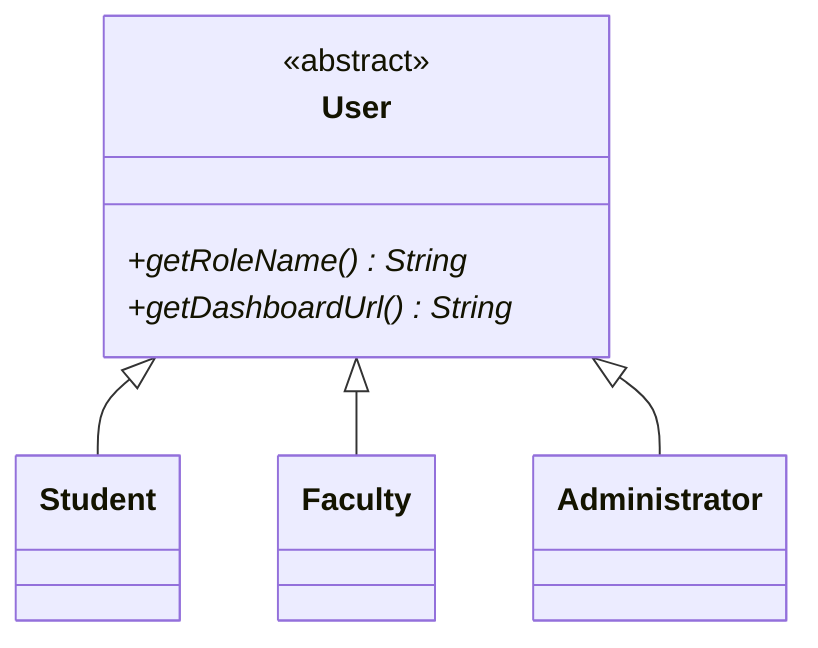

# Student Project & Team Management Platform (CoVe)

**Course:** CSE2006 – Programming in Java  
**Institution:** Vellore Institute of Technology (VIT Bhopal University)  
**Evaluation Component:** VITyarthi - Build Your Own Project  
**Platform Codename:** CoVe (Collaborative Venture)  

[](https://adoptium.net/)
[](https://spring.io/projects/spring-boot)
[]()
[]()

---

## 1. Project Title
**CoVe: Centralized Academic Student Project & Team Management Platform**

---

## 2. Overview
**CoVe** is a full-stack, enterprise-grade academic collaboration web application designed to solve student team formation and project governance challenges in university courses. 

Rather than functioning as a rudimentary CRUD tool, CoVe delivers an **explainable, rule-based skill compatibility matching algorithm**, **concurrency-safe team slot allocation**, **Kanban task boards**, **milestone roadmap computation**, and a **multithreaded background daemon** that audits deadlines continuously. Every architectural component directly demonstrates core concepts from the VIT Bhopal **CSE2006 (Programming in Java)** syllabus.

---

## 3. Problem Statement
In university engineering programs, students and faculty guides encounter systemic hurdles:
- **Haphazard Team Formation**: Students rely on informal social media channels to locate teammates, resulting in unbalanced teams with overlapping skill redundancies (e.g., three frontend designers with no backend developer).
- **Black-Box Selection**: Existing grouping tools lack transparency; students cannot evaluate why a peer was recommended.
- **Responsibility Fragmentation**: Tasks and action items are lost in unstructured chat histories.
- **Evaluation Opacity**: Faculty mentors lack visibility into milestone completion.
- **Concurrent Race Conditions**: Simultaneous joining of popular project slots causes team over-capacity when shared state is not synchronized.

---

## 4. Objectives
1. Provide a **transparent rule-based skill matching engine** that calculates deterministic compatibility scores with explainable checklist badges (`Java ✓`, `SQL ✓`).
2. Guarantee **thread-safe synchronization** during team enrollment to eliminate race condition over-subscriptions.
3. Construct a **multithreaded background daemon** that periodically audits overdue tasks without blocking user requests.
4. Implement a **dual persistence model** using Spring Data JPA for domain entities and direct JDBC (`java.sql.*`) for analytical reports.
5. Deploy **Java Character and Byte I/O Streams** for exporting academic dossiers (TXT) and task/team rosters (CSV).

---

## 5. Target Users
- **Student Project Leads**: Propose projects, define technical competencies, match and recruit teammates, assign tasks, track milestone progress.
- **Student Contributors**: Maintain verified technical skill profiles, discover complementary projects, claim tasks, monitor personal deadlines.
- **Faculty Mentors**: Supervise course capstones, guide task distribution, verify milestones, download official academic dossiers.
- **Platform Administrators**: Monitor system health, review student workload metrics, inspect cross-project skill demand via direct JDBC analytics.

---

## 6. Features
- **Deterministic Skill Matching**: Mathematical overlap scoring with proficiency weight bonuses and transparent audit trails.
- **Concurrency-Safe Enrollment**: Fair `ReentrantLock` and synchronized critical sections preventing over-capacity breaches.
- **Proactive Deadline Daemon**: Background worker thread continuously checking deadlines and dispatching notifications.
- **Kanban Task Board**: Drag/click task movement across `TODO`, `IN_PROGRESS`, `BLOCKED`, and `COMPLETED` with strict state transition validation.
- **Mathematical Progress Engine**: Computes project completion based on milestone ($60\%$) and task ($40\%$) fulfillment.
- **PriorityQueue Task Scheduling**: Tasks ordered automatically by severity (`CRITICAL` > `HIGH`) and due date.
- **I/O Stream Dossier & CSV Exporters**: Instant one-click file generation via Character and Byte streams.
- **Direct JDBC Analytics**: High-performance aggregate queries using `PreparedStatement` and `ResultSetMetaData`.
- **Instant Evaluator Quick Login**: 1-click authentication to test Student, Faculty, and Admin personas immediately.

---

## 7. Functional Modules
```
┌────────────────────────────────────────────────────────────────────────┐
│                        CoVe FUNCTIONAL MODULES                         │
├────────────────────────────────────────────────────────────────────────┤
│ 1. Identity & Profile Module (Polymorphic User, Student, Faculty, Admin)│
│ 2. Extensible Skills Taxonomy Module (Dynamic Catalog & Proficiency)   │
│ 3. Project Lifecycle Engine (IDEA -> ARCHIVED with State Transitions)  │
│ 4. Rule-Based Matching Engine (Method Overloading & Scoring Math)      │
│ 5. Synchronized Team Management Module (Thread-Safe Slot Allocation)   │
│ 6. Kanban Task Board & PriorityQueue Scheduling Module                 │
│ 7. Milestone Roadmap & Mathematical Progress Engine                    │
│ 8. Multithreaded Background Deadline Monitoring Daemon                 │
│ 9. Direct JDBC Analytics & Aggregation DAO                             │
│ 10. Java I/O Streams Exporter & Ingestion Engine                       │
│ 11. Custom Exception Handling & REST Advice Layer                      │
│ 12. Responsive Modern Presentation Layer                               │
└────────────────────────────────────────────────────────────────────────┘
```

---

## 8. User Roles & Hierarchy

- **Student**: Can propose projects, recruit teammates, manage tasks, and maintain acquired skills.
- **Faculty**: Can mentor projects, review team submissions, verify milestone deliverables, and download project dossiers.
- **Administrator**: Can oversee platform metrics, inspect raw JDBC analytics, and monitor background daemon diagnostics.

---

## 9. Skill Matching Explanation
The matching engine is **strictly rule-based and deterministic**:

$$\text{Overlap \%} = \frac{\text{Number of Matching Skills}}{\text{Total Required Skills}} \times 100$$

$$\text{Weighted Score} = \frac{\sum_{s \in \text{Matched}} W(s) \times \left(1.0 + 0.1 \times (\text{ActualLevel} - \text{RequiredLevel})\right)}{\sum W(s)}$$

### Transparent Checklist Output:
- `Java` (Req: INTERMEDIATE, Student: EXPERT) $\rightarrow$ `MATCH ✓` (Bonus: +0.2)
- `SQL` (Req: INTERMEDIATE, Student: INTERMEDIATE) $\rightarrow$ `MATCH ✓` (Score: 1.0)
- `React` (Req: BEGINNER, Student: Missing) $\rightarrow$ `MISSING ✗` (Score: 0.0)
- **Result:** $2/3$ Skills Matched ($66.7\%$) $\rightarrow$ `STRONG_MATCH`.

---

## 10. Architecture
Follows a clean **4-Tier Layered Architecture**:
- **Presentation Layer**: HTML5, Modern CSS Grid/Flexbox, Vanilla JS Client (`app.js`).
- **REST Controller Layer**: Spring Web MVC endpoints validating DTO requests.
- **Business Logic Layer**: Services implementing core algorithms and thread synchronization.
- **Persistence Layer (Dual)**: Spring Data JPA (Hibernate) + Direct JDBC (`JdbcProjectAnalyticsDao`).
- **Storage Layer**: Portable across embedded H2 (default) and MySQL 8.0.

---

## 11. Technology Stack
- **Language**: Java 17 LTS (Eclipse Temurin OpenJDK)
- **Framework**: Spring Boot 3.2.3
- **ORM / Persistence**: Hibernate / Spring Data JPA & Direct JDBC (`java.sql.*`)
- **Database**: H2 Database (Default In-Memory/File), MySQL 8.0 (Configurable)
- **Build Tool**: Apache Maven 3.9.6 (bundled `mvnw.cmd` / `mvnw`)
- **Testing**: JUnit 5 (Jupiter), Mockito
- **Frontend**: HTML5, Responsive Modern CSS, Vanilla JavaScript
- **Version Control**: Git & GitHub CLI

---

## 12. Java Concepts Demonstrated
| Syllabus Topic | Indicative Experiment / Unit | Concrete Implementation in CoVe |
| :--- | :--- | :--- |
| **Variables & Flow Control** | Unit 1 / Exp 15 | Rule-based matching loops, scoring math, state transition checks. |
| **Classes & Objects** | Unit 2 / Exp 2 | 15+ rich domain models (`User`, `Project`, `Team`, `Task`, `Milestone`). |
| **Constructors & Chaining** | Unit 2 / Exp 1, 7 | Constructor overloading and chaining via `this(...)` and `super(...)`. |
| **Encapsulation** | Unit 2 | Private fields with public accessors protecting domain boundary invariants. |
| **Inheritance** | Unit 2 / Exp 5 | Abstract `User` extended by `Student`, `Faculty`, `Administrator`. |
| **Method Overriding** | Unit 2 / Exp 6, 8 | Overridden polymorphic methods `getRoleName()`, `getDashboardUrl()`. |
| **Run-time Polymorphism** | Unit 2 / Exp 9 | Dynamic method dispatch resolving user dashboards and role permissions. |
| **Method Overloading** | Unit 2 / Exp 3, 4 | Overloaded matcher methods `evaluateStudent(...)` and `findMatchingCandidates(...)`. |
| **Abstract Classes & Interfaces** | Unit 2 / Exp 11, 12 | Abstract `User.java`, interfaces `Comparable<Task>`, `Comparable<Skill>`. |
| **Enums with Fields & Methods** | Unit 2 | `ProficiencyLevel`, `ProjectStatus`, `TaskPriority`, `TaskStatus`. |
| **Custom Exceptions** | Unit 3 | Custom hierarchy (`TeamFullException`, `InvalidProjectStateException`, etc.). |
| **Multithreading** | Unit 3 / Exp 13 | `DeadlineMonitoringDaemon.java` extending `Thread` class with full lifecycle. |
| **Synchronization** | Unit 3 | `synchronized` methods & fair `ReentrantLock` eliminating race conditions in team slots. |
| **Collections Framework** | Unit 4 / Exp 10 | `ArrayList`, `HashSet`, `PriorityQueue` (task severity), `Collections.sort`. |
| **Java I/O Streams** | Unit 4 / Exp 16 | Character streams (`PrintWriter`, `BufferedWriter`) & Byte streams (`ByteArrayOutputStream`). |
| **Direct JDBC API** | Unit 5 / Exp 14 | `Connection`, `PreparedStatement`, `ResultSet`, and `ResultSetMetaData`. |
| **JPA / Hibernate** | Unit 5 | `@Entity`, `@Table`, `@Id`, `@ManyToOne`, `@OneToMany`, `@OneToOne`, `@Version`. |

---

## 13. Database Design
*(See `docs/database-design.md` for complete schema specifications and entity relationships).*

---

## 14. Project Structure
```
c:\CoVe
├── .gitignore
├── pom.xml
├── mvnw / mvnw.cmd
├── README.md
├── statement.md
├── docs/
│   ├── architecture.md
│   ├── workflow.md
│   ├── design-decisions.md
│   ├── database-design.md
│   ├── testing.md
│   ├── java-concepts.md
│   ├── matching-algorithm.md
│   └── project-report.md
└── src/
    ├── main/
    │   ├── java/com/vityarthi/cove/
    │   │   ├── config/ (DataInitializer.java)
    │   │   ├── controller/ (Auth, Project, Matching, Team, Task, Analytics, Report)
    │   │   ├── dao/ (JdbcProjectAnalyticsDao.java)
    │   │   ├── dto/ (AuthRequest, ProjectRequest, TaskRequest, SkillMatchResponse)
    │   │   ├── exception/ (Custom exceptions & GlobalExceptionHandler)
    │   │   ├── io/ (CharacterStreamExporter, ByteStreamExporter, CsvImporter)
    │   │   ├── model/ (User, Student, Faculty, Project, Team, Task, Milestone)
    │   │   ├── repository/ (JPA repository interfaces)
    │   │   ├── service/ (Matching, Team, Task, Milestone, Daemon)
    │   │   └── StudentProjectPlatformApplication.java
    │   └── resources/
    │       ├── application.properties (Default H2 mode)
    │       ├── application-mysql.properties (Production MySQL mode)
    │       ├── data/skills-catalog.csv
    │       └── static/ (HTML, CSS, JS frontend assets)
    └── test/java/com/vityarthi/cove/
        ├── SkillMatchingServiceTest.java
        ├── TeamConcurrencyTest.java
        ├── ProjectLifecycleTest.java
        ├── TaskAndMilestoneProgressTest.java
        ├── JdbcAnalyticsDaoTest.java
        └── ReportExportIOTest.java
```

---

## 15. Installation Requirements
- **JDK**: Java Development Kit 17 LTS or higher (Installed: Eclipse Temurin OpenJDK 17.0.20.1)
- **Build Tool**: Apache Maven 3.9+ (Bundled `mvnw.cmd` included in repository)
- **Operating System**: Windows 10/11, macOS, or Linux
- **Web Browser**: Chrome, Firefox, Edge, or Safari

---

## 16. Setup
1. Clone the repository:
   ```bash
   git clone https://github.com/Tanu-codeveda/CoVe-Student-Project-Platform.git
   cd CoVe
   ```
2. Ensure Java 17 is recognized:
   ```powershell
   java -version
   ```

---

## 17. Database Configuration
- **Zero-Configuration Academic Evaluation (Default)**:
  - Runs out of the box with embedded H2 database.
  - H2 Web Console: Accessible at `http://localhost:8080/h2-console` (JDBC URL: `jdbc:h2:mem:covedb`, User: `sa`, Password: empty).
- **MySQL 8.0 Production Profile**:
  - To connect to local MySQL Server on port 3306:
    ```powershell
    .\mvnw.cmd spring-boot:run -Dspring-boot.run.profiles=mysql
    ```

---

## 18. Run Instructions
Start the Spring Boot platform using the wrapper:
```powershell
# Windows
.\mvnw.cmd spring-boot:run

# Linux / macOS
./mvnw spring-boot:run
```
Once launched, open your web browser at:
👉 **`http://localhost:8080`**

### Instant Evaluator Quick Logins:
- **Student**: Click *"Login as Student (Tanu)"* (or `tanu.gowda@vitbhopal.ac.in` / `student123`)
- **Faculty Guide**: Click *"Login as Faculty (Dr. Ashwin)"* (or `ashwin.m@vitbhopal.ac.in` / `faculty123`)
- **Administrator**: Click *"Login as Administrator"* (or `admin@vitbhopal.ac.in` / `admin123`)

---

## 19. Test Instructions
Execute the complete JUnit test suite:
```powershell
.\mvnw.cmd test
```
**Results:** All 16 unit, lifecycle, I/O, JDBC, and multithreaded concurrency tests pass with 0 failures.

---

## 20. Screenshots & UI Walkthrough
- **Landing Page (`/`)**: Overview, course alignment badges, and 1-click evaluator login.
- **Student Dashboard (`/dashboard.html`)**: Active projects, technical skill inventory, and severity-ranked tasks from `PriorityQueue`.
- **Project Workspace (`/project-details.html?id=1`)**:
  - *Overview Tab*: Problem specification and required competencies.
  - *Team Tab*: Team roster and thread-safe enrollment button.
  - *Skill Matcher Tab*: Evaluates available students and displays transparent checklist badges (`Java ✓`, `SQL ✓`).
  - *Kanban Tasks Tab*: Interactive cards moved across `TODO`, `IN_PROGRESS`, `BLOCKED`, and `COMPLETED`.
  - *Milestones Tab*: Interactive roadmap checkboxes dynamically updating project progress.
  - *I/O Reports Tab*: Direct downloads for Dossier (TXT) and CSV files.
- **Admin & JDBC Console (`/admin-dashboard.html`)**: Direct JDBC tables for skill demand and student workload, plus live thread diagnostic gauges.

---

## 21. Git Workflow
The repository strictly adheres to Git Flow branching and atomic development commits:
- `main`: Production-stable release branch.
- `develop`: Active integration development branch.
- Feature commits record each milestone chronologically.

---

## 22. Known Limitations
- Current skill proficiencies are self-asserted during registration.
- Background daemon runs in the JVM; in multi-node clustered deployments, a distributed leader lock (e.g. Redis/ShedLock) would be needed.

---

## 23. Future Enhancements
- Automated GitHub API integration to verify student skills by scanning public commit repositories.
- WebSockets for instant peer-to-peer messaging inside project workspaces.
- Automated code plagiarism detection for project deliverable submissions.

---

## 24. References
1. Herbert Schildt, *Java: The Complete Reference*, 11th Edition, Oracle Press, 2018.
2. Cay S. Horstmann, *Core Java Volume I – Fundamentals*, 11th Edition, Pearson, 2018.
3. VIT Bhopal University CSE2006 Programming in Java Course Syllabus.
4. Oracle Java SE 17 API Specification (Threads, Synchronization, Collections, I/O Streams, JDBC).
