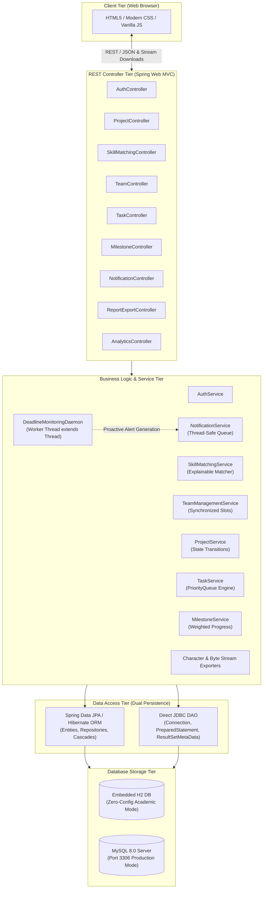
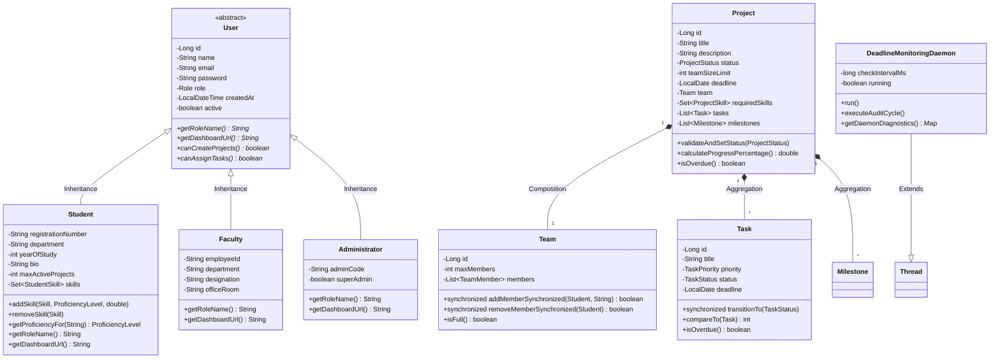

# System Architecture Document

## 1. Architectural Overview

The **Student Project & Team Management Platform (CoVe)** is engineered following a clean **N-Tier Layered Architecture** with strict separation of concerns:

1. **Presentation Layer (Web UI)**: Responsive HTML5/CSS3/JavaScript single-page and multi-page interfaces styled with university branding.
2. **REST Controller Layer**: Exposes contract-driven JSON and streaming HTTP endpoints, validating incoming requests and delegating to business services.
3. **Business Logic & Service Layer**: Encapsulates core domain rules:
   - Rule-based skill matching engine (method overloading, collections).
   - Team allocation service (thread-safe synchronization and capacity locks).
   - Project lifecycle service (state pattern and transition guards).
   - Task scheduling service (PriorityQueue ordering).
   - Milestone progress engine (weighted mathematical formula).
   - Multithreaded deadline monitoring daemon (extending `Thread`).
   - Java I/O reporting engine (character & byte streams).
4. **Data Access & Persistence Layer (Dual Persistence)**:
   - **Spring Data JPA / Hibernate**: Handles transactional CRUD and relational entity graphs.
   - **Direct JDBC (`java.sql.*`)**: `JdbcProjectAnalyticsDao` executes raw SQL queries via `PreparedStatement` and inspects `ResultSetMetaData` for analytical reporting.
5. **Database Layer**: Portable across **H2 In-Memory Database** (default for academic review) and **MySQL 8.0** (production profile).

---

## 2. System Architecture Diagram

---

## 3. Class Diagram & Inheritance Hierarchy

