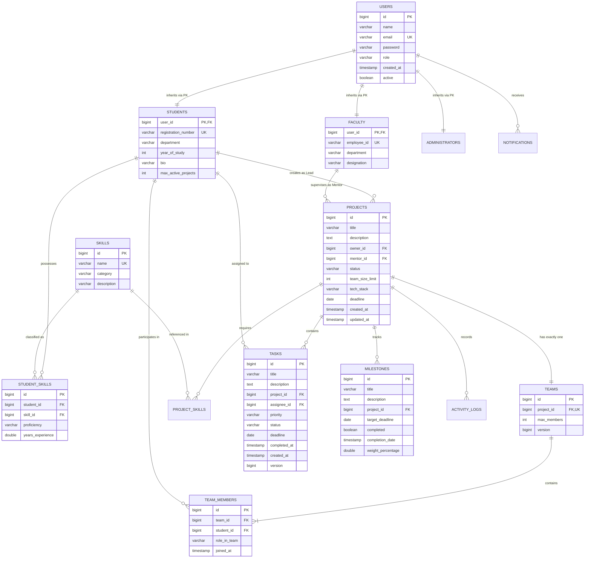

# Database Design & Storage Architecture

## 1. Entity-Relationship (ER) Diagram

---

## 2. Table Specifications & Constraints

### 1. `users` & Subtype Tables (`InheritanceType.JOINED`)
- `users`: Base polymorphic table. Stores credentials and role discriminator.
- `students`: Contains university-specific academic identifiers (`registration_number` unique).
- `faculty`: Contains faculty identifiers (`employee_id` unique).

### 2. `skills` & `student_skills`
- `skills`: Catalog of extensible technologies. Unique constraint on `name`.
- `student_skills`: Associative join table linking student to skill with `proficiency` (`BEGINNER`, `INTERMEDIATE`, `ADVANCED`, `EXPERT`) and years of experience. Composite uniqueness on `(student_id, skill_id)`.

### 3. `projects` & `project_skills`
- `projects`: Primary academic project entity. Status managed via `ProjectStatus` enum.
- `project_skills`: Defines minimum required proficiency and weight for rule-based matching. Composite uniqueness on `(project_id, skill_id)`.

### 4. `teams` & `team_members`
- `teams`: 1-to-1 relationship with `projects`. Maintains `@Version` column for optimistic locking in addition to synchronized slot logic.
- `team_members`: Links student to project team with custom roles (`Project Lead`, `Backend Architect`, `Frontend Lead`). Composite uniqueness on `(team_id, student_id)` prevents duplicate enrollment.

### 5. `tasks` & `milestones`
- `tasks`: Work breakdown tasks with priority severity ordering (`CRITICAL` > `HIGH` > `MEDIUM` > `LOW`) and status constraints.
- `milestones`: Structured evaluation roadmap with percentage weighting ($0-100\%$).
