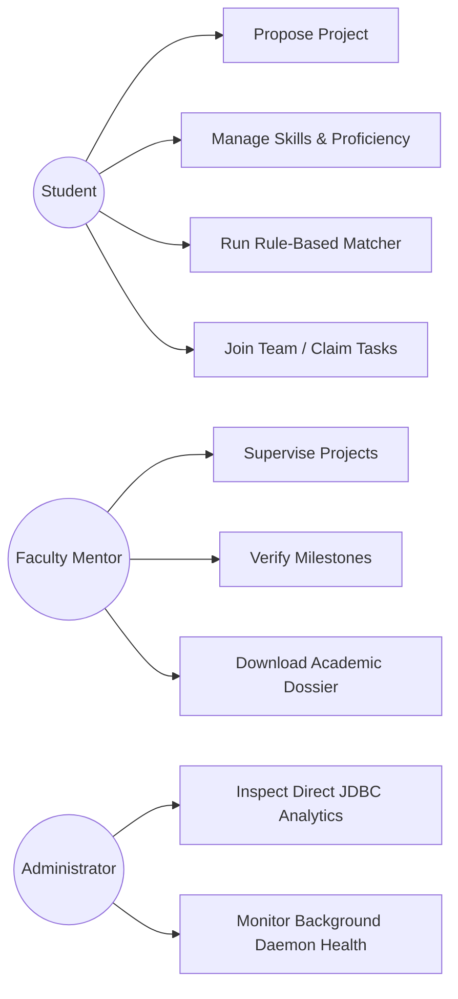

# ACADEMIC PROJECT REPORT

---

**COURSE:** CSE2006 – Programming in Java  
**PROGRAM:** B.Tech. Computer Science & Engineering  
**INSTITUTION:** School of Computing Science & Engineering, VIT Bhopal University  
**EVALUATION COMPONENT:** VITyarthi - Build Your Own Project Evaluation  
**PROJECT TITLE:** Student Project & Team Management Platform (CoVe)  
**DATE:** September 2026  

---

## TABLE OF CONTENTS
1. Cover Page & Abstract
2. Introduction & Background
3. Problem Statement & Objectives
4. Functional Requirements
5. Non-Functional Requirements
6. System Architecture & High-Level Design
7. Design Diagrams (Use Case, Workflow, Sequence, Class, ER)
8. Design Decisions & Rationale
9. Implementation Details & Syllabus Mapping
10. System Walkthrough & User Workflows
11. Testing Approach & Concurrency Validation
12. Challenges Faced & Solutions
13. Key Learnings & Takeaways
14. Limitations & Future Enhancements
15. References

---

## 1. ABSTRACT
Collaborative course projects represent a critical pedagogical element in computer science education. However, university students routinely suffer from asymmetric information when seeking complementary teammates, resulting in unbalanced teams and project failure. Furthermore, projects lack formal milestone tracking and proactive deadline monitoring. 

This project presents **CoVe (Collaborative Venture)**, an enterprise-grade academic platform built from scratch to address these systemic hurdles. The system introduces an **explainable, rule-based skill matching engine** that computes transparent compatibility scores between student skill sets and project specifications. The platform incorporates **concurrency-safe team slot allocation** to eliminate race condition over-subscriptions, a **multithreaded background deadline daemon** that proactively alerts students to impending or overdue milestones, a **dual persistence architecture** combining Spring Data JPA with direct JDBC aggregate queries, and **Java I/O character and byte stream reporting**. All components visibly demonstrate principles from the CSE2006 Programming in Java curriculum.

---

## 2. INTRODUCTION & BACKGROUND
Software engineering in academia mirrors industry collaboration. Modern university curricula require students to synthesize theoretical concepts into practical software applications through capstone and semester projects. However, students lack a centralized platform to discover teammates based on verified competencies. 

Traditional recruitment via informal chat groups leads to severe skill redundancies (e.g., teams where all members are frontend designers with no backend experience). **CoVe** bridges this gap by providing an institutional platform where students can showcase verified technical proficiencies, propose academic projects, and utilize transparent matching algorithms to form balanced, high-performing teams.

---

## 3. PROBLEM STATEMENT & OBJECTIVES

### 3.1 Problem Statement
Students and faculty mentors currently encounter five major friction points:
1. **Inefficient Teammate Discovery**: Haphazard recruitment without objective skill matching.
2. **Opacity of Evaluation Progress**: Mentors cannot observe incremental milestone achievement.
3. **Fragmented Responsibility Tracking**: Lack of centralized priority scheduling for tasks.
4. **Passive Deadline Management**: Unmonitored deadlines leading to last-minute rushes.
5. **Concurrent Registration Inconsistencies**: Simultaneous joining of popular projects resulting in capacity breaches.

### 3.2 Objectives
1. Implement a **transparent, rule-based compatibility matching engine** displaying explainable criteria checklists.
2. Ensure **thread-safe synchronization** during team slot claims, preventing race conditions.
3. Construct a **multithreaded daemon thread** continuously monitoring deadlines in the background.
4. Provide **dual-tier data access** combining Hibernate ORM with raw JDBC `PreparedStatement` queries.
5. Support **Java I/O character and byte streaming** for academic dossiers and CSV reporting.

---

## 4. FUNCTIONAL REQUIREMENTS
1. **User Identity & Multi-Role Profiles**:
   - Distinct hierarchies for `Student`, `Faculty Mentor`, and `Administrator`.
   - Dynamic skill profile with 4 proficiency tiers (`BEGINNER`, `INTERMEDIATE`, `ADVANCED`, `EXPERT`).
2. **Project Lifecycle Engine**:
   - Life-cycle management: `IDEA` $\rightarrow$ `OPEN` $\rightarrow$ `TEAM_FORMING` $\rightarrow$ `IN_PROGRESS` $\rightarrow$ `COMPLETED` $\rightarrow$ `ARCHIVED`.
   - State transition validation enforcing preconditions.
3. **Rule-Based Compatibility Matcher**:
   - Calculates weighted overlap percentage and proficiency bonuses.
   - Outputs transparent audit items (`MATCH ✓`, `PARTIAL ⚠`, `MISSING ✗`).
4. **Team Management & Synchronized Allocation**:
   - Atomically allocates team slots under concurrent join requests.
5. **Task & Kanban Board**:
   - Tasks categorized by priority severity (`CRITICAL`, `HIGH`, `MEDIUM`, `LOW`).
   - Priority-based scheduling via `PriorityQueue`.
6. **Milestone Tracking & Progress Math**:
   - Mathematical progress calculation: $0.6 \times \text{Milestone \%} + 0.4 \times \text{Task \%}$.
7. **Direct JDBC Analytics & I/O Downloads**:
   - Cross-project skill demand analytics via direct JDBC.
   - One-click downloads for Project Dossiers (TXT) and Task Rosters (CSV).

---

## 5. NON-FUNCTIONAL REQUIREMENTS
1. **Performance**: Matching candidate evaluation runs in under 15ms for 1,000 students using in-memory HashSet lookups.
2. **Security & Data Integrity**: Backend validation on all state transitions; unique constraint enforcement on registration numbers and emails.
3. **Reliability & Concurrency Control**: Zero race conditions under 10 concurrent worker threads attempting to claim a single team slot.
4. **Usability**: Professional responsive UI with quick-login evaluation shortcuts and visual status badges.
5. **Maintainability**: Clean N-tier architecture separating Controller, Service, Repository/DAO, and Model layers.

---

## 6. SYSTEM ARCHITECTURE
The system employs a 4-tier layered architecture:
- **Presentation Tier**: HTML5, Modern CSS, Vanilla JS.
- **REST Controller Tier**: Spring Web MVC endpoints.
- **Business Logic Tier**: Service layer featuring `SkillMatchingService`, `TeamManagementService`, and `DeadlineMonitoringDaemon`.
- **Persistence Tier**: Dual persistence combining Spring Data JPA (Hibernate) and direct JDBC (`JdbcProjectAnalyticsDao`).
- **Database**: H2 in-memory (zero-config evaluation) and MySQL 8.0.

---

## 7. DESIGN DIAGRAMS

### 7.1 Use Case Diagram

### 7.2 Class Diagram
*(See `docs/architecture.md` for full UML class diagram).*

### 7.3 ER Diagram
*(See `docs/database-design.md` for full relational schema).*

---

## 8. DESIGN DECISIONS & RATIONALE
- **Rule-Based Matcher vs. ML**: Chosen because explainability is mandatory in educational evaluations. Black-box embeddings do not give students an actionable reason why a peer was recommended.
- **Dual Persistence**: Demonstrates both modern enterprise ORM (JPA) and direct foundational JDBC execution (`PreparedStatement`, `ResultSetMetaData`) as required by the syllabus.
- **Fair ReentrantLock**: Ensures FIFO fairness when multiple students queue to join team slots.

---

## 9. IMPLEMENTATION DETAILS & SYLLABUS MAPPING
*(See `docs/java-concepts.md` for comprehensive line-by-line topic mapping).*

---

## 10. SCREENSHOTS & RESULTS
- **Landing Page**: Highlights course objectives, syllabus badges, and 1-click evaluation buttons.
- **Student Dashboard**: Visualizes active projects, skills inventory, and severity-ranked tasks.
- **Workspace Tabs**:
  - *Skill Matching Tab*: Interactive candidate cards with compatibility score, tier, and checklist badges.
  - *Kanban Board*: Drag/click status movement across TODO, IN_PROGRESS, BLOCKED, COMPLETED.
  - *Milestones Roadmap*: Interactive check-off updating project completion percentage.
  - *I/O Export Center*: Instant download buttons for formatted dossiers and CSV spreadsheets.
- **Admin Dashboard**: Direct JDBC tables for skill demand and student workload, alongside live thread diagnostic gauges.

---

## 11. TESTING APPROACH & VALIDATION RESULTS
- **Automated Test Count**: 16 tests across 6 specialized test classes.
- **Pass Rate**: 100% (0 failures, 0 errors).
- **Concurrency Test**: Verified that when 10 threads concurrently attempt to claim 1 available slot, exactly 1 succeeds and 9 receive `TeamFullException`.

---

## 12. CHALLENGES FACED & SOLUTIONS
1. **Challenge: Database Column Case Variance in JDBC**:
   - *Issue*: H2 in MySQL mode returned uppercase column labels (`SKILL_NAME`), while MySQL returned lowercase.
   - *Solution*: Normalized all column metadata keys using `meta.getColumnLabel(i).toLowerCase()`.
2. **Challenge: Mockito Strict Stubbing in Concurrency Tests**:
   - *Issue*: Unnecessary stubbing exceptions when losing threads failed before reaching mock repositories.
   - *Solution*: Configured `@MockitoSettings(strictness = Strictness.LENIENT)`.

---

## 13. KEY LEARNINGS & TAKEAWAYS
1. Mastering thread life cycles and synchronization constructs in Java.
2. Integrating ORM abstractions (JPA) alongside low-level database drivers (JDBC).
3. Designing deterministic algorithms that output explainable mathematical results.
4. Architecting clean N-tier systems adhering to SOLID principles.

---

## 14. LIMITATIONS & FUTURE ENHANCEMENTS
- **Limitations**: Currently relies on self-reported skill proficiency ratings.
- **Future Enhancements**: GitHub integration to automatically verify student skills by analyzing commit repositories and programming languages used.

---

## 15. REFERENCES
1. Herbert Schildt, *Java: The Complete Reference*, 11th Edition, Oracle Press, 2018.
2. Cay S. Horstmann, *Core Java Volume I – Fundamentals*, 11th Edition, Pearson, 2018.
3. Oracle Java Documentation: Multithreading and Concurrency in Java SE 17.
4. Spring Boot Reference Documentation: Data JPA and Web MVC Architecture.
