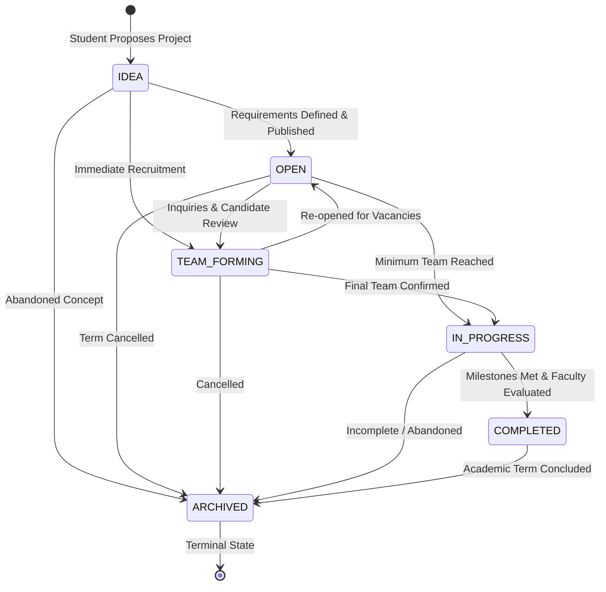
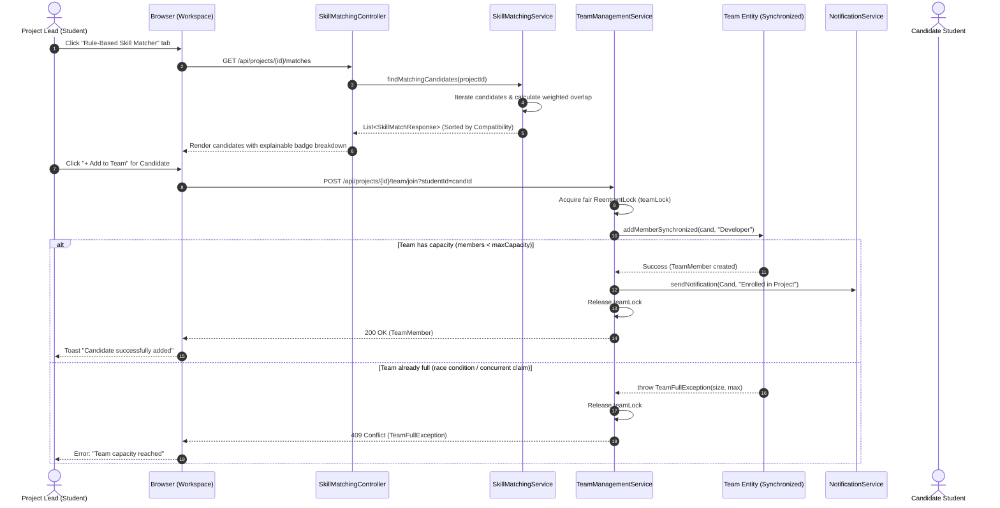
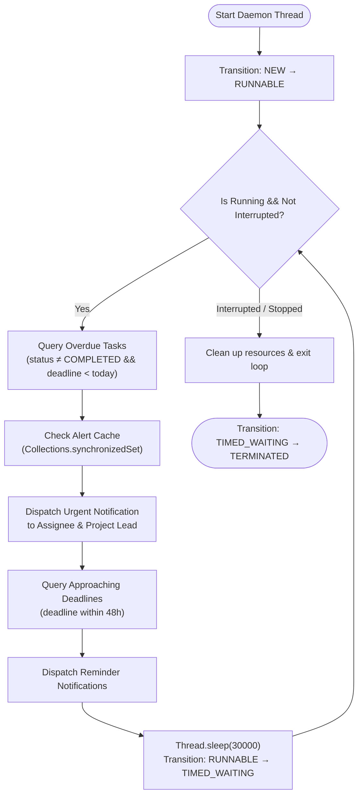

# System Workflows & Process Flows

## 1. Project Lifecycle State Transition Flow

Projects transition through a strict state machine implemented in `ProjectStatus.java`. Illegal transitions (such as transitioning directly from `IDEA` to `COMPLETED` or reviving an `ARCHIVED` project) are rejected with `InvalidProjectStateException`.

---

## 2. Rule-Based Skill Matching & Team Formation Sequence

This diagram details the sequence when a project lead reviews candidate students and enrolls a new teammate, demonstrating **thread-safe synchronization**:

---

## 3. Multithreaded Background Deadline Daemon Workflow

